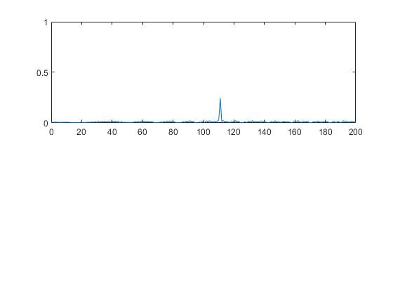

# RadarTargetDetection
## Overview 
In this project it was generated a [FMCW Waveform](https://en.wikipedia.org/wiki/Continuous-wave_radar) using a beat signal with the following properties,


and simulated as follows:


Using this simulated signal, an initial object was set on initial range of 110m and initial velocity 20 m/s.
The next steps are the computation of range and velocity in real time of the target object. For this purpose, the following algorithms will be implemented during this project:
* FFT (Fast fourier transform): computation of range in real time
* 2D FFT: computation of range doppler map
* 2D CFAR: noise filtering to find the object peak velocity 

The pipeline can be summed up in the following description:


## Implementation of FMCW waveform 

Using the defined initial range and velocity, we can compute the range through time,

```
rt= t*v_init + initial_target_range
```
In order to compute the delay time, considering it is a rounding trip with electromagnetic wave (speed of light c ), it can be computed as:
```
td= rt*(2/c)
```
Considering a sinusoidal wave with frequency fc (77GHz) and time delay previously computed, beat signal is generated as follows:
```
Beat= cos(2*pi*(fc*t +Slope*t*t/2)) *cos(2*pi*(fc*(t-td) +Slop*(t-td)*(t-td)/2)) 
```

## Implementation of FFT 
The implementation of FFT is described as follows:
* Reshape Beat signal to matrix size [Nr,Nd] (Nd is the number of chirsp: Nr is the number of samples per chirp)
* Apply FFT transform to previously computed Beat signal and normalize it by Nr
* The FFT signal is a complex number, lets take the absolute value of it 
* In addition, the previously result is symmetric let's take only the positive frequency part 

The final result is the following: 



As it is expected it peaks at 110m, which corresponds to the initial object range.


## Implementation of 2D FFT 


